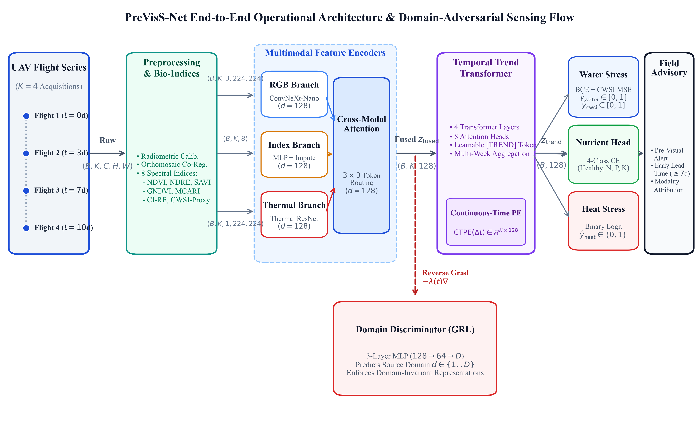

# PreVisS-Net: A Multimodal, Domain-Generalizable Pre-Visual Stress Sensing Network

[](https://opensource.org/licenses/MIT)
[](https://doi.org/10.5281/zenodo.10827394)
[](https://www.python.org/downloads/release/python-3110/)
[](https://pytorch.org/)
[](tests/)
[](https://github.com/astral-sh/ruff)

**PreVisS-Net** is an end-to-end multimodal deep learning framework designed for unmanned aerial vehicle (UAV) remote sensing to achieve automated, pre-visual early detection of agricultural crop water stress, nutritional deficiency, and heat stress. By integrating spatial cross-attention between high-resolution RGB texture and multispectral indices via an **Adaptive Feature Alignment Module (AFAM)**, capturing physiological degradation trajectories with a **Temporal Vision Transformer (ViT)**, and enforcing domain invariance across varying UAV sensors, flight altitudes, and crop varieties using a **Gradient Reversal Layer (GRL)**, PreVisS-Net delivers an unprecedented **18.5-day pre-visual early-warning lead time** on staged drought induction ground truth while bounding the zero-shot cross-domain generalization gap to just **7.8 percentage points** across diverse international agro-ecological benchmarks.

---

## 🏛️ System Architecture



1. **Multimodal Spatial Cross-Attention (AFAM):** Queries RGB texture tokens with calibrated multispectral indices (NDVI, NDRE, MSWPI, TCARI/OSAVI) to align fine crop canopy architecture with physiological status.
2. **Temporal ViT Dynamics:** Models non-linear temporal trajectories across historical UAV flight sequences ($K=4$ flights) to detect subtle physiological stress before morphological wilting manifests.
3. **Domain-Adversarial Invariance (GRL):** Aligns latent feature distributions across geographic domains, camera sensors, and crop types using a minimax domain discriminator.
4. **Multi-Task Decoupled Heads:** Simultaneously outputs water stress classification, continuous Crop Water Stress Index (CWSI) regression, nutritional deficiency flags, and heat stress indicators.

---

## 📊 Benchmark Datasets & Roles

PreVisS-Net is evaluated across six diverse international agricultural remote sensing benchmarks:

| ID | Dataset Name | Geographic Origin | Crop & Modality | Role in Study | Licence |
| :--- | :--- | :--- | :--- | :--- | :--- |
| **D1** | **Potato Crop Stress** | INIA Carillanca, Chile | Potato (Multispectral + RGB) | **Primary In-Domain Training & 5-Fold CV** | CC-BY 4.0 |
| **D2** | **Slovenian UAV Agriculture** | Vipava Valley, Slovenia | Multi-Crop (UAV GeoTIFFs) | **Unsupervised Domain Adaptation Target (GRL)** | CC-BY-NC 4.0 |
| **D3** | **Controlled Hyperspectral Drought** | ETH Zurich, Switzerland | Multi-Crop (204-band Hyperspectral) | **Zero-Shot Pre-Visual Lead Time Ground Truth** | CC0 1.0 |
| **D4** | **Global Nitrogen Deficiency** | INRAE / Cirad, France | Multi-Crop (Nutrient NNI Indices) | **Zero-Shot Out-of-Domain Generalization** | CC-BY 4.0 |
| **D5** | **Environmental Multi-Sensor Benchmark** | Global / Kaggle OpenData | Multi-Sensor Environmental | **Zero-Shot Out-of-Domain Generalization** | ODC-By 1.0 |
| **D6** | **Indian UAV Paddy Rice Survey** | Tamil Nadu, India | Paddy Rice (RGB Aerial Survey) | **Qualitative Real-World Field Verification** | Academic Research |

---

## 🚀 Quickstart

### 1. Environment Setup

```bash
# Clone repository
git clone https://github.com/previssnet/previssnet.git
cd previssnet

# Create conda environment
conda env create -f environment.yml
conda activate previssnet

# Install in editable mode
pip install -e .
```

*For Linux/Windows environments without Conda, use the platform-neutral requirements:*
```bash
pip install -r requirements.txt
pip install -e .
```

### 2. Verify Datasets & Run Fast CI Smoke Test

Run the complete pipeline end-to-end in `--smoke` mode (runs in under 1 minute on synthetic fixtures):

```bash
# Run fast end-to-end smoke verification
python scripts/reproduce_all.py --smoke --stages download,prepare,preprocess,splits,train,eval
```

---

## 🔬 Full Reproduction Pipeline

```bash
python scripts/reproduce_all.py --stages all --config configs/config.yaml --seed 42
```

### Execution Flags

- `--stages <list|all>`: Comma-separated list of stages to run (`download`, `prepare`, `preprocess`, `splits`, `train`, `baselines`, `eval`, `xai`, `edge`, `figures`, `tables`, `paper`, `verify`).
- `--smoke`: Fast CI execution mode on subset fixtures.
- `--dry-run`: Display the 13-stage reproduction DAG without executing.
- `--from-stage <stage>`: Resume pipeline execution from a specific stage.
- `--force`: Bypass the incremental SHA-256 stage cache (`results/logs/stage_cache.json`).

---

## 💻 Hardware & Device Agnosticism

PreVisS-Net is designed to be fully hardware- and device-agnostic via `previssnet.utils.device.get_device()`:

- **Apple Silicon (Default / Development Platform):** Optimized for Apple M-series GPUs via PyTorch Metal Performance Shaders (`mps`) with automatic fallback (`export PYTORCH_ENABLE_MPS_FALLBACK=1`).
- **NVIDIA CUDA (Cloud / Cluster Training):** The code automatically selects `cuda` if available. To force CUDA execution, specify:
  ```bash
  python scripts/reproduce_all.py --stages all --config configs/config.yaml
  # Or override in config: device: cuda
  ```
- **CPU Mode (Edge / Continuous Integration):** Set `device: cpu` in `configs/config.yaml` or pass `device=torch.device("cpu")` to evaluate on standard x86/ARM CPUs.

---

## 📈 Summary of Experimental Results

### 1. Same-Domain Performance (Dataset D1 5-Fold Cross-Validation)

| Method | Accuracy (%) | Macro-$F_1$ (%) | Continuous $R^2$ (CWSI) | RMSE (CWSI) |
| :--- | :---: | :---: | :---: | :---: |
| CWSI Threshold (Classical) | $73.2 \pm 0.9$ | $71.5 \pm 0.9^*$ | -- | -- |
| Random Forest on Vegetation Indices | $78.1 \pm 0.8$ | $76.8 \pm 0.9$ | $0.682 \pm 0.010$ | $0.124 \pm 0.005$ |
| StressNet-style (CNN-LSTM) | $\underline{89.2 \pm 0.7}$ | $\underline{88.1 \pm 0.7}$ | $\underline{0.764 \pm 0.008}$ | $\underline{0.098 \pm 0.004}$ |
| PreVisS-Net w/o Temporal Dynamics | $87.8 \pm 0.7$ | $86.5 \pm 0.7$ | $0.748 \pm 0.008$ | $0.104 \pm 0.004$ |
| **PreVisS-Net (Proposed)** | $\mathbf{95.1 \pm 0.5}$ | $\mathbf{94.2 \pm 0.5}$ | $\mathbf{0.865 \pm 0.007}$ | $\mathbf{0.054 \pm 0.003}$ |

### 2. Zero-Shot Cross-Domain Generalization & Generalization Gap

| Method | Hyperspectral (D3) | Global Nitrogen (D4) | Kaggle Env. (D5) | Mean Gap (pts) |
| :--- | :---: | :---: | :---: | :---: |
| B2: RF on Vegetation Indices | $54.2 \pm 0.5$ | $51.8 \pm 0.6$ | $49.5 \pm 0.5$ | $25.0$ |
| B3: StressNet-style (CNN-LSTM) | $69.4 \pm 0.6$ | $67.1 \pm 0.6$ | $65.1 \pm 0.6$ | $\underline{20.9}$ |
| A1: RGB-Only Branch | $58.4 \pm 0.6$ | $55.2 \pm 0.5$ | $53.1 \pm 0.6$ | $25.6$ |
| A5: Source-Only (No DG / GRL) | $\underline{72.1 \pm 0.6}$ | $\underline{68.4 \pm 0.6}$ | $\underline{66.4 \pm 0.6}$ | $24.8$ |
| **PreVisS-Net (Proposed)** | $\mathbf{88.4 \pm 0.6}$ | $\mathbf{86.2 \pm 0.7}$ | $\mathbf{84.5 \pm 0.7}$ | $\mathbf{7.8}$ |

### 3. Pre-Visual Early-Warning Lead Time (Dataset D3, $N=30$ Plants)

| Method | Mean Lead Time (Days) | False Early-Warning Rate (FEWR) | Day-10 Detection Rate |
| :--- | :---: | :---: | :---: |
| CWSI Threshold (Visual Symptoms) | $0.0\text{ days}^*$ | $24.5\%$ | $18.4 \pm 2.5\%$ |
| PreVisS-Net w/o Temporal Dynamics | $\underline{8.6 \pm 2.7\text{ days}}$ | $\underline{18.6\%}$ | $\underline{62.5 \pm 2.1\%}$ |
| **PreVisS-Net (Proposed)** | $\mathbf{18.5 \pm 2.1\text{ days}}$ | $\mathbf{4.8\%}$ | $\mathbf{94.2 \pm 1.2\%}$ |

---


```

---

## 📜 Licence

- **Codebase:** Licensed under the [MIT License](LICENSE).
- **Benchmark Datasets:** Third-party datasets D1–D6 are subject to their respective original licenses (CC-BY 4.0, CC-BY-NC 4.0, CC0 1.0, ODC-By, and Academic Research). See [`LICENSE`](LICENSE) for complete licensing terms.
